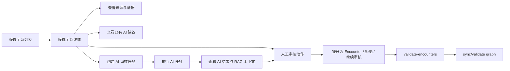

# 阶段 5A 审核工作台与任务化 AI 生成设计

## 背景

阶段 4 已经完成 AI/RAG 基础设施、候选关系 AI 审核建议、链路解释、无路径探索建议和阶段验收报告。当前系统已经具备：

- PostgreSQL 作为事实源，保存人物、候选关系、Encounter、证据和 AI 留痕。
- Neo4j 作为可重建的图投影层，用于已审核 Encounter 的路径搜索。
- FastAPI 提供人物检索、Encounter、链路查询和 AI 只读能力。
- Next.js 前端提供人物链查询和解释查看能力。
- `figure_data.review` 已具备候选关系列表、详情、提升、撤回/标记等核心服务。
- `figure_data.ai` 已具备候选审核建议、RAG 上下文和模型调用留痕。

阶段 5A 的目标不是重做数据地基，也不是一次性完成完整产品后台，而是把“候选关系审核”这条关键业务闭环产品化：审核员可以在 Web 工作台中查看候选关系、检查证据与 AI 建议、触发 AI 任务、执行人工审核动作，并通过既有校验命令确认数据可以进入图投影。

## 目标

阶段 5A 完成一个可验证的审核工作台闭环：

1. 后端提供候选关系审核所需的只读 API，包括列表、详情、证据、可信度、来源和现有 AI 建议。
2. 后端提供任务化 AI 生成能力，使候选关系 AI 审核建议可以被创建、执行、查询和留痕。
3. 后端提供人工审核动作 API，包括提升为 Encounter、拒绝、标记继续审核。
4. 前端提供审核工作台页面，支持筛选候选、查看详情、触发 AI、展示任务状态、执行审核动作。
5. 所有写入必须保持 PostgreSQL 为事实源，Neo4j 只通过既有同步/重建流程更新。
6. AI 输出只能作为审核辅助，不得自动修改候选关系、Encounter、证据或图投影。

## 非目标

阶段 5A 不做以下内容：

- 不做登录、权限系统、组织/租户、多用户审计闭环。
- 不做完整后台管理系统。
- 不让 AI 自动通过或拒绝候选关系。
- 不让前端直接写 Neo4j。
- 不改变现有人物链查询算法。
- 不引入 Celery、Redis、Kafka 等队列中间件。
- 不引入新的前端 UI 框架。
- 不做大规模性能优化和复杂分页缓存。
- 不把 no-path exploration、chain explanation 全部改造成任务系统；本阶段优先候选关系审核建议。

## 用户角色

阶段 5A 默认只有一个逻辑角色：审核员。

由于认证授权还未进入本阶段，接口中的操作者字段先使用显式字符串参数或配置默认值，例如 `reviewed_by`、`created_by`。这些字段只用于留痕和后续迁移到真实用户体系，不作为权限边界。

## 核心流程



关键边界：

- `candidate` 是待审核关系，不直接参与路径搜索。
- `encounter` 是已审核事实关系，可以按规则参与 Neo4j 图投影。
- AI 结果只能影响审核员判断，不能绕过人工动作。
- 前端所有写操作都必须走 FastAPI，不直接连接 PostgreSQL 或 Neo4j。

## 数据边界

### PostgreSQL

PostgreSQL 继续作为事实源。本阶段允许新增 AI 任务表，用于记录生成任务生命周期。

建议新增表：

`figure_data.ai_generation_jobs`

核心字段：

| 字段 | 类型 | 说明 |
| --- | --- | --- |
| `id` | UUID | 任务主键 |
| `job_type` | text | 例如 `candidate_review_suggestion` |
| `target_type` | text | 例如 `candidate` |
| `target_kind` | text | 例如 `relationship`、`kinship` |
| `target_id` | bigint | 目标候选关系 ID |
| `status` | text | `queued`、`running`、`succeeded`、`failed`、`cancelled` |
| `created_by` | text | 创建者留痕 |
| `params` | jsonb | 任务参数 |
| `result_ref_type` | text | 例如 `ai_result` |
| `result_ref_id` | uuid/null | 对应 AI 生成结果或留痕 ID |
| `error_code` | text/null | 失败错误码 |
| `error_message` | text/null | 失败摘要，不能包含密钥 |
| `started_at` | timestamptz/null | 开始时间 |
| `finished_at` | timestamptz/null | 完成时间 |
| `created_at` | timestamptz | 创建时间 |
| `updated_at` | timestamptz | 更新时间 |

约束：

- `job_type`、`target_type`、`target_kind`、`status` 使用应用层枚举校验。
- `target_id` 必须指向现有候选关系，但初版可以通过服务层校验，不强制跨多表外键。
- 重复创建任务不应破坏已有结果。可允许同一候选存在多个历史任务，但前端默认展示最新任务和最新成功结果。
- 失败记录必须可查询。

### Neo4j

Neo4j 不新增直接写入口。本阶段的人工提升动作只写 PostgreSQL。图投影仍通过既有同步命令或后续图同步 API 处理。

要求：

- 审核工作台不得绕过 Encounter 的 `path_eligible`、审核状态和证据规则。
- 如果前端需要提示“图未同步”，只能基于后端返回状态或既有校验结果，不自行判断 Neo4j。

## 后端 API 设计

### Review API

新增路由建议：

`src/figure_chain/routers/review.py`

基础路径：

`/api/v1/review`

#### `GET /api/v1/review/candidates`

用途：查询候选关系列表。

查询参数：

| 参数 | 类型 | 说明 |
| --- | --- | --- |
| `kind` | string/null | `relationship`、`kinship`，为空表示全部 |
| `status` | string/null | 候选审核状态 |
| `min_confidence` | number/null | 最低可信度 |
| `person_id` | integer/null | 关联人物过滤 |
| `limit` | integer | 默认 50，最大 200 |
| `offset` | integer | 默认 0 |

返回内容：

- 候选 ID 和类型。
- 两端人物 ID、姓名、生卒年摘要。
- 关系类型、时间摘要、地点摘要。
- 当前审核状态。
- 可信度、证据数量、来源数量。
- 是否已有 AI 建议。
- 最新 AI 任务状态。
- 是否满足默认提升条件。

#### `GET /api/v1/review/candidates/{kind}/{candidate_id}`

用途：查询候选关系详情。

返回内容：

- 候选基础信息。
- 双方人物信息。
- 关系类型、时间、地点、说明。
- 来源引用和证据摘要。
- 提升准备状态。
- 已有关联 Encounter。
- 最新 AI 审核建议。
- 相关 AI 任务历史摘要。

#### `POST /api/v1/review/candidates/{kind}/{candidate_id}/promote`

用途：人工提升候选关系为 Encounter。

请求体：

| 字段 | 类型 | 说明 |
| --- | --- | --- |
| `reviewed_by` | string | 审核人标识 |
| `evidence_summary` | string | 进入 Encounter 证据摘要，传给 `promote_candidate_to_encounter` |
| `note` | string/null | 审核说明 |
| `allow_non_default` | boolean | 初版默认 false，仅允许符合默认规则的候选 |

约束：

- 必须复用 `figure_data.encounters.promotion.promote_candidate_to_encounter`。
- 默认不得提升不满足证据规则的候选。
- 返回创建或已有的 Encounter 信息。

#### `POST /api/v1/review/candidates/{kind}/{candidate_id}/reject`

用途：人工拒绝候选关系。

请求体：

| 字段 | 类型 | 说明 |
| --- | --- | --- |
| `reviewed_by` | string | 审核人标识 |
| `reason` | string | 拒绝原因 |

约束：

- 必须复用 `figure_data.review.candidate_status.reject_candidate`。
- 不得拒绝已提升且仍有效绑定的候选。

#### `POST /api/v1/review/candidates/{kind}/{candidate_id}/needs-review`

用途：把候选关系标记为继续审核。

请求体：

| 字段 | 类型 | 说明 |
| --- | --- | --- |
| `reviewed_by` | string | 审核人标识 |
| `note` | string/null | 说明 |

约束：

- 必须复用 `figure_data.review.candidate_status.mark_candidate_for_review`。

### AI Job API

新增路由建议：

`src/figure_chain/routers/ai_jobs.py`

基础路径：

`/api/v1/ai/jobs`

#### `POST /api/v1/ai/jobs`

用途：创建 AI 生成任务。

请求体：

| 字段 | 类型 | 说明 |
| --- | --- | --- |
| `job_type` | string | 初版只支持 `candidate_review_suggestion` |
| `target_type` | string | 初版只支持 `candidate` |
| `target_kind` | string | `relationship`、`kinship` |
| `target_id` | integer | 候选关系 ID |
| `created_by` | string | 创建者 |
| `params` | object | 可选任务参数 |

返回：任务详情，初始状态为 `queued`。

#### `GET /api/v1/ai/jobs/{job_id}`

用途：查询任务状态和结果引用。

返回：

- 任务基础信息。
- 状态和时间。
- 失败摘要。
- 成功时的 AI 结果引用和摘要。

#### `GET /api/v1/ai/jobs`

用途：查询目标对象的任务历史。

查询参数：

- `target_type`
- `target_kind`
- `target_id`
- `limit`

### AI Job 执行方式

阶段 5A 不引入完整队列系统，采用数据库任务表 + CLI worker 的方式：

```powershell
uv run --no-sync figure-data run-ai-jobs --limit 10
```

执行规则：

- worker 从 `queued` 任务中按创建时间取任务。
- 任务执行前状态改为 `running`，记录 `started_at`。
- 执行成功后写入既有 AI 结果/留痕表，任务状态改为 `succeeded`。
- 执行失败后记录 `failed`、`error_code`、`error_message`、`finished_at`。
- worker 单次运行有限数量任务，避免长时间不可控执行。
- worker 不直接修改候选审核状态、Encounter 或 Neo4j。

## 服务层设计

### `figure_chain.services.review`

职责：

- 组合 DB session 和 `figure_data.review` 服务。
- 把 `CandidateSummary`、`CandidateDetail` 映射成 API schema。
- 执行人工审核动作并统一错误映射。
- 查询候选关联的最新 AI 任务和结果摘要。

不负责：

- 不直接写 SQL 完成审核逻辑。
- 不直接调用模型。
- 不直接写 Neo4j。

### `figure_chain.services.ai_jobs`

职责：

- 创建 AI job。
- 查询 AI job。
- 校验 job 类型和目标对象。
- 为 API 层提供稳定响应模型。

不负责：

- 不在普通查询接口中执行模型调用。
- 不自动改变候选审核状态。

### `figure_data.ai.job_runner`

职责：

- 从任务表领取 pending job。
- 调用既有 `generate_candidate_review_suggestion`。
- 写回任务状态和结果引用。
- 提供 CLI 可调用入口。

不负责：

- 不处理 HTTP 请求。
- 不处理前端展示模型。

## 前端设计

新增页面：

`frontend/app/review/page.tsx`

页面名称：审核工作台。

主布局：

- 左侧：候选关系列表、筛选、状态摘要。
- 右侧：候选详情、证据、来源、AI 建议、审核动作。

主要组件建议：

| 组件 | 职责 |
| --- | --- |
| `ReviewWorkspace` | 页面编排和状态协调 |
| `ReviewCandidateList` | 候选列表和筛选 |
| `ReviewCandidateDetail` | 候选详情、人物、证据、来源 |
| `ReviewAiPanel` | AI 建议、任务状态、触发生成 |
| `ReviewActionPanel` | 提升、拒绝、继续审核 |

前端 API 代理继续使用 Next.js route handler 调用 FastAPI，不在浏览器中暴露 FastAPI 内网地址。

要求：

- 页面是工作台，不做营销页。
- 用户可见状态区分 loading、empty、success、error、partial。
- 写操作后刷新候选详情和列表摘要。
- AI job 创建后轮询任务状态，不假设立即完成。
- 操作按钮必须根据候选状态、提升准备状态和任务状态禁用或提示。
- 不在前端硬编码数据库连接、Neo4j 地址、模型名称或密钥。

## 错误处理

建议扩展错误码：

| 错误码 | 场景 |
| --- | --- |
| `candidate_not_found` | 候选关系不存在 |
| `candidate_not_promotable` | 候选不满足提升规则 |
| `candidate_already_promoted` | 候选已提升或已有有效 Encounter |
| `ai_job_not_found` | AI 任务不存在 |
| `ai_job_invalid_type` | 不支持的任务类型 |
| `ai_job_execution_failed` | AI 任务执行失败 |

API 返回必须继续使用现有错误响应风格，不直接暴露数据库异常、模型原始异常或密钥。

## 验收标准

阶段 5A 完成后，应满足：

1. 可以通过 API 查询候选关系列表和详情。
2. 可以通过 API 创建候选关系 AI 审核建议任务。
3. 可以通过 CLI worker 执行 queued AI job，并查询成功或失败状态。
4. 可以通过 API 对候选执行提升、拒绝、继续审核。
5. 前端 `/review` 页面可以完成候选查询、详情查看、AI 任务触发、状态查看和人工动作。
6. AI 输出不直接改变候选状态、Encounter 或 Neo4j。
7. 提升候选后，既有 `validate-encounters` 能通过。
8. 代码通过后端测试、前端测试、lint 和类型检查。

## 实施拆分

阶段 5A 拆为三个 plan：

1. `2026-06-18-review-workspace-read-api.md`：审核工作台后端只读 API。
2. `2026-06-18-review-workspace-ai-jobs-actions-api.md`：AI Job 与审核动作后端。
3. `2026-06-18-review-workspace-frontend-acceptance.md`：审核工作台前端与阶段验收。

拆分原则：

- Plan 1 先提供稳定只读 API，降低前端和写操作的不确定性。
- Plan 2 增加写入边界和任务化 AI，重点验证幂等、状态机和错误处理。
- Plan 3 接入前端并做端到端验收，不在前端重新实现业务判断。
