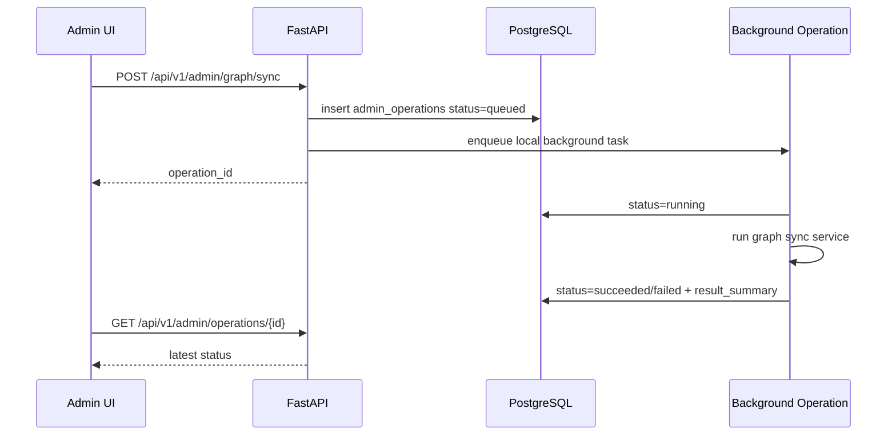

# 本地系统控制台总纲设计

## 背景

当前 FigureChain 已经具备以下基础能力：

- PostgreSQL 是人物、候选关系、Encounter、证据、AI 留痕和图同步批次的事实源。
- Neo4j 是可重建的图查询投影，只承载已审核、可进入路径搜索的 Encounter。
- `figure-data` CLI 已覆盖候选审核、Encounter 提升/撤回、图同步、图校验、AI job 和诊断。
- FastAPI 已提供人物链查询、候选审核、AI job、证据详情等产品 API。
- Next.js 已有 `/review` 审核工作台雏形，支持候选列表、候选详情、AI 建议、提升、拒绝和标记待复核。

当前痛点是日常维护仍依赖手写 CLI、手查数据库或直接改数据库。后台能力应把这些日常维护动作产品化，而不是暴露任意 SQL 或任意 shell。

## 定位

第一版后台是 **本地单人系统控制台**，入口为 `/admin`。

它的目标是替代以下日常操作：

1. 手动拼 `figure-data` 命令。
2. 手动查询候选关系、Encounter、AI job、图同步批次等数据库内容。
3. 直接改数据库完成候选审核或状态维护。
4. 手动判断 PostgreSQL、Neo4j、Redis/RQ、AI provider 和 graph projection 是否健康。

后台不是通用数据库管理器，不提供任意 SQL 编辑器，不执行任意 shell 字符串。

## 目标

第一版需要形成一个可用的本地维护闭环：

1. 提供白名单资源查询器，支持字段筛选、条件组合、排序、分页和详情跳转。
2. 提供固定维护动作面板，覆盖候选审核、Encounter 管理、图同步、AI job 和诊断。
3. 提供 CLI 预览，让用户理解当前 UI 操作对应的 `figure-data` 命令。
4. 提供 `admin_operations` 操作历史，记录每次有副作用的后台操作。
5. 迁移或复用现有 `/review` 审核工作台，使其成为 `/admin/review` 的一部分。
6. 保持 PostgreSQL 为事实源，Neo4j 只能通过既有投影流程更新。

## 非目标

第一版不做以下内容：

- 不做登录、组织、租户、多用户权限系统。
- 不开放任意 SQL 查询或任意数据库写入。
- 不执行用户输入的 shell 命令。
- 不让浏览器直接连接 PostgreSQL、Neo4j、Redis 或模型 provider。
- 不让 AI 自动提升、拒绝、撤回候选或写入 Neo4j。
- 不替换现有 `figure-data` CLI；CLI 仍作为本地运维和脚本入口保留。
- 不做完整数据导入管理后台。
- 不做生产级分布式任务系统；长耗时后台 operation 先面向本地单进程使用。

## 信息架构

后台页面建议按能力分区：

```text
/admin
  /data          资源查询器和关联跳转
  /graph         Neo4j 同步、校验、投影状态
  /jobs          AI job、worker、requeue/retry/cancel
  /review        候选审核工作台，迁移现有 /review
  /operations    操作历史
  /diagnostics   doctor 状态和依赖诊断
```

`/admin` 首页展示系统概览：

- PostgreSQL、Neo4j、Redis/RQ、AI provider 状态摘要。
- active/path_eligible Encounter 数量。
- 最新 graph projection batch。
- AI job 队列状态。
- 最近失败的 admin operation。
- 常用入口：数据查询、图重建、图校验、候选审核、AI job。

## 资源查询器

资源查询器是白名单查询界面。它像 SQL builder，但不接受任意 SQL。前端只能提交结构化查询，后端按资源定义生成固定 SQLAlchemy 查询或受控 SQL。

第一批资源：

| 资源 | 用途 |
| --- | --- |
| `relationship_candidates` | 查看关系候选、审核状态、候选强度和来源 |
| `kinship_candidates` | 查看亲属候选、审核状态和来源 |
| `encounters` | 查看已提升 Encounter、状态、证据规则和路径资格 |
| `encounter_evidence` | 查看 Encounter 证据、候选来源和 source ref |
| `persons` | 查看人物主表和基础标识 |
| `source_refs` | 查看来源片段、页码和 source work 关联 |
| `source_works` | 查看来源书目 |
| `ai_generation_jobs` | 查看 AI 任务状态、失败原因和重试信息 |
| `ai_job_events` | 查看 AI job 事件流 |
| `graph_projection_batches` | 查看图同步批次、校验状态和摘要 |
| `admin_operations` | 查看后台操作历史 |

查询能力：

- `select`：默认展示资源定义中的主要字段，可切换字段。
- `where`：支持资源白名单字段和操作符。
- `order_by`：仅允许资源定义中的可排序字段。
- `limit/offset`：第一版最大 `limit=200`。
- `preview`：显示等价 CLI 或查询摘要。

建议操作符：

| 操作符 | 说明 |
| --- | --- |
| `eq` | 等于 |
| `ne` | 不等于 |
| `in` | 多选 |
| `contains` | JSON/list 包含或文本包含，由资源定义决定 |
| `ilike` | 文本模糊匹配 |
| `gte` / `lte` | 数值或时间范围 |
| `is_null` / `is_not_null` | 空值判断 |

后端响应应包含列元信息，避免前端靠字段名猜链接：

```json
{
  "resource": "relationship_candidates",
  "columns": [
    {"key": "candidate_id", "label": "candidate_id", "type": "int", "link": "candidate"},
    {"key": "person_a_id", "label": "person_a_id", "type": "uuid", "link": "person"},
    {"key": "promoted_encounter_id", "label": "promoted_encounter_id", "type": "uuid", "link": "encounter"}
  ],
  "rows": [],
  "limit": 50,
  "offset": 0
}
```

## 关联详情跳转

资源查询结果必须支持关联详情跳转，减少手动复制 ID。

第一版链接规则：

| 字段或字段组合 | 跳转 |
| --- | --- |
| `person_id`、`person_a_id`、`person_b_id` | 人物详情 |
| `candidate_kind + candidate_id` | 候选详情和审核动作 |
| `candidate_table + candidate_id` | 候选详情 |
| `encounter_id`、`promoted_encounter_id` | Encounter 详情 |
| `source_ref_id` | Source ref 详情 |
| `source_work_id` | Source work 详情 |
| `ai_run_id` | AI run 详情 |
| `job_id`、`ai_generation_job_id` | AI job 详情 |
| `graph_projection_batch_id` | 图同步批次详情 |
| `admin_operation_id` | 操作历史详情 |

前端展示上，链接字段仍保留原始值；点击打开详情页或侧边详情面板。第一版可以优先使用现有详情页，再补缺失详情页。

## 固定维护动作

后台维护动作必须走后端 service，不执行 shell 字符串。

第一版动作：

### 候选审核

- 查看候选详情。
- 提升为 Encounter。
- 拒绝候选。
- 标记待复核。
- 创建候选 AI 审核建议 job。

复用现有 review API 和 service：

- `GET /api/v1/review/candidates`
- `GET /api/v1/review/candidates/{kind}/{candidate_id}`
- `POST /api/v1/review/candidates/{kind}/{candidate_id}/promote`
- `POST /api/v1/review/candidates/{kind}/{candidate_id}/reject`
- `POST /api/v1/review/candidates/{kind}/{candidate_id}/needs-review`

### Encounter 管理

- 查看 Encounter 详情和证据。
- 撤回 Encounter。
- 查看同一候选或同一人物对相关记录。

撤回必须复用既有 `figure_data.encounters` service，不直接更新表。

### 图同步

- `validate-encounters`
- `sync-graph --rebuild`
- `sync-graph --incremental`
- `validate-graph`

这些动作写入 `admin_operations`，并以后台 operation 方式执行。

### AI job

- 查看 job 列表。
- 查看 job events。
- cancel。
- retry。
- requeue recoverable jobs。
- 查看 Redis/RQ 配置和 worker 状态。

优先复用现有 AI job API 和 repository。

### 诊断

- 网页版 `doctor`。
- PostgreSQL、Neo4j、Redis/RQ、AI provider、graph projection batch 状态。
- 给出下一步建议和相关动作入口。

## CLI 预览

每个查询和动作应展示等价 CLI 或说明性预览。

示例：

```powershell
figure-data review-candidates --kind relationship --status unreviewed --limit 50
```

```powershell
figure-data promote-encounter --kind relationship --id 960655 --reviewed-by lyl --evidence-summary "<input>"
```

```powershell
figure-data sync-graph --rebuild
figure-data validate-graph
```

CLI 预览只用于解释和复制，不作为后端执行输入。后端执行必须调用明确 service 或 repository。

## 操作历史

新增表：`figure_data.admin_operations`。

用途：

- 记录后台有副作用动作。
- 给长耗时动作提供状态轮询。
- 保留失败原因和结果摘要。
- 让本地单人维护也有可复盘记录。

建议字段：

| 字段 | 类型 | 说明 |
| --- | --- | --- |
| `id` | UUID | 操作主键 |
| `operation_type` | text | 操作类型 |
| `actor` | text | 本地操作者，例如 `local` 或 `lyl` |
| `status` | text | `queued`、`running`、`succeeded`、`failed`、`cancelled` |
| `request_payload` | jsonb | 操作参数，不能包含密钥 |
| `result_summary` | jsonb | 结构化结果摘要 |
| `error_message` | text/null | 失败摘要，不能包含密钥 |
| `related_resource_type` | text/null | 关联资源类型 |
| `related_resource_id` | text/null | 关联资源 ID |
| `started_at` | timestamptz/null | 开始时间 |
| `finished_at` | timestamptz/null | 完成时间 |
| `created_at` | timestamptz | 创建时间 |
| `updated_at` | timestamptz | 更新时间 |

第一版操作类型：

```text
promote_candidate
reject_candidate
mark_candidate_needs_review
retract_encounter
validate_encounters
sync_graph_rebuild
sync_graph_incremental
validate_graph
requeue_ai_jobs
cancel_ai_job
retry_ai_job
doctor
```

单条动作同步执行，但仍记录操作历史。图同步、图校验、批处理类动作创建后台 operation，页面轮询操作状态。

## 后台 Operation 执行模型

第一版本地单人版使用 FastAPI `BackgroundTasks` 或等价的本地后台执行封装。

流程：



约束：

- 后台 operation 不依赖 Redis/RQ，避免本地第一版启动成本过高。
- 如果 FastAPI 进程退出，正在执行的 operation 可能中断；下一次 diagnostics 应能标出长期 `running` 的 stale operation。
- 未来如果需要更可靠的执行，可把后台 operation 迁移到 RQ，但 API 和 `admin_operations` 表不需要大改。

## 后端 API 总览

新增 Admin API：

```text
GET  /api/v1/admin/resources
POST /api/v1/admin/resources/query

GET  /api/v1/admin/operations
GET  /api/v1/admin/operations/{operation_id}

GET  /api/v1/admin/diagnostics

GET  /api/v1/admin/graph/status
POST /api/v1/admin/graph/validate-encounters
POST /api/v1/admin/graph/sync
POST /api/v1/admin/graph/validate-graph

POST /api/v1/admin/ai/jobs/requeue
```

现有 API 继续复用：

```text
GET/POST /api/v1/review/...
GET/POST /api/v1/ai/jobs...
GET      /api/v1/encounters/{encounter_id}
GET      /api/v1/people/{person_id}
GET      /api/v1/source-refs/{source_ref_id}
GET      /api/v1/source-works/{source_work_id}
```

Next.js 继续通过 route handlers 代理 FastAPI，不在浏览器端暴露内部服务地址。

## 本地单人访问边界

第一版不做登录系统，但仍需保留最小边界：

- 后台页面默认用于本机开发环境。
- 写操作请求必须带 `actor` 字段；默认可使用 `local`，界面允许用户设置为 `lyl`。
- API 错误不得返回完整数据库连接串、Redis URL、AI API key 或 provider 原始敏感响应。
- 操作历史中的 `request_payload` 和 `result_summary` 必须过滤密钥字段。
- 文档明确说明该后台不是生产公开管理面板。

## 前端体验原则

后台是运维工具，不是营销页。界面应安静、密集、可扫描：

- 顶部或侧边导航按 `/data`、`/graph`、`/jobs`、`/review`、`/operations`、`/diagnostics` 分区。
- 数据表格支持固定列宽、横向滚动、分页和复制 ID。
- 详情可以使用右侧面板或详情页，避免在表格里塞过多内容。
- 有副作用动作必须展示确认摘要。
- 长耗时 operation 提交后立即返回 operation id，并显示轮询状态。
- 错误展示要包含可执行的下一步，例如“先启动 Redis”或“执行 full rebuild”。

## 与现有代码的关系

应优先复用现有能力：

- `/review` 页面迁移或包装为 `/admin/review`。
- `ReviewService` 继续承载候选审核 API 的应用逻辑。
- `figure_data.encounters` 继续承载提升和撤回逻辑。
- `figure_data.graph` 继续承载 Neo4j 投影和校验逻辑。
- `figure_data.ai.job_repository` 和 RQ adapter 继续承载 AI job 状态与队列逻辑。
- `figure-data` CLI 保留，Admin API 调用同一批 service，避免 CLI 与 Web 逻辑分叉。

如果某个 CLI 命令目前只有入口层逻辑，应先抽出 service，再让 CLI 和 Admin API 共同调用。

## 验收标准

第一版完成后应满足：

1. 用户可以从 `/admin/data` 查询白名单资源，并通过链接跳转到人物、候选、Encounter、source、AI job 或 graph batch 详情。
2. 用户可以从后台执行候选审核和 Encounter 撤回动作，动作结果进入 `admin_operations`。
3. 用户可以从 `/admin/graph` 执行图同步和图校验，并通过 operation 状态查看结果。
4. 用户可以从 `/admin/jobs` 查看 AI job、事件、失败原因，并执行 retry/cancel/requeue。
5. 用户可以从 `/admin/diagnostics` 查看 PostgreSQL、Neo4j、Redis/RQ、AI provider 和 graph projection 状态。
6. 所有有副作用动作都有 CLI 预览和操作历史。
7. 前端不发送任意 SQL 或任意 shell 字符串。
8. 后端不执行任意 SQL 或任意 shell 字符串。
9. 现有人物链查询、审核工作台和 CLI 行为不被破坏。

## 分阶段建议

### 阶段 1：后台壳和资源查询器

- 建立 `/admin` 布局和导航。
- 新增 resource registry、metadata API 和 query API。
- 支持第一批资源的只读查询和关联跳转。

### 阶段 2：操作历史和图同步

- 新增 `admin_operations` 表和 repository。
- 新增 operation service。
- 实现 graph status、validate、sync、validate-graph 后台 operation。

### 阶段 3：迁移审核与 AI job

- 将现有 `/review` 包装或迁移为 `/admin/review`。
- 将 AI job 列表、events、retry/cancel/requeue 纳入 `/admin/jobs`。
- 统一 actor 输入和操作历史写入。

### 阶段 4：诊断和收口

- 实现 `/admin/diagnostics`。
- 增加 stale operation 检测。
- 补齐文档、测试和本地 smoke。

## 风险与约束

- 白名单资源过多会导致第一版变慢；应优先实现核心资源，再逐步增加。
- 后台 operation 使用本地 BackgroundTasks 时，进程退出会中断任务；第一版通过 stale 标识和重试入口处理。
- 图同步和图校验可能依赖外部 Neo4j 状态；页面必须显示失败原因，不假装成功。
- 本地单人版没有真正权限边界；不能部署为公网后台。
- 资源查询器如果绕过 service 暴露过多原始字段，可能让 UI 混淆候选、Encounter、AI 辅助结果的事实边界；列定义必须明确标注资源类型和可信状态。

